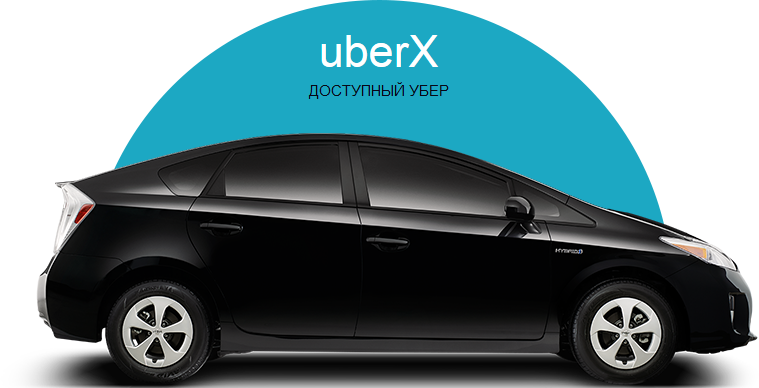

# uber
Страница сайта компании Uber
# 

#### 💻 верстка сайта выполнена по PSD макету, свободно распространяемому в интернете  
#### один из таких ресурсов может быть, например, 👉[freepic](https://ru.freepik.com/psd/web-templates)
#### макеты можно взять и на сайте 👉[figma](https://figma.com.ru/templates/)
#### При вестке страницы применены:👇
#### ✔️ технология bootstrap 5;
#### ✔️ слайдеры, различные как по форме, так и по содержанию;
#### ✔️ некоторые изображения отсутствуют в макете, пришлось дополнить самостоятельно;
#### ✔️ немного Java Script;

